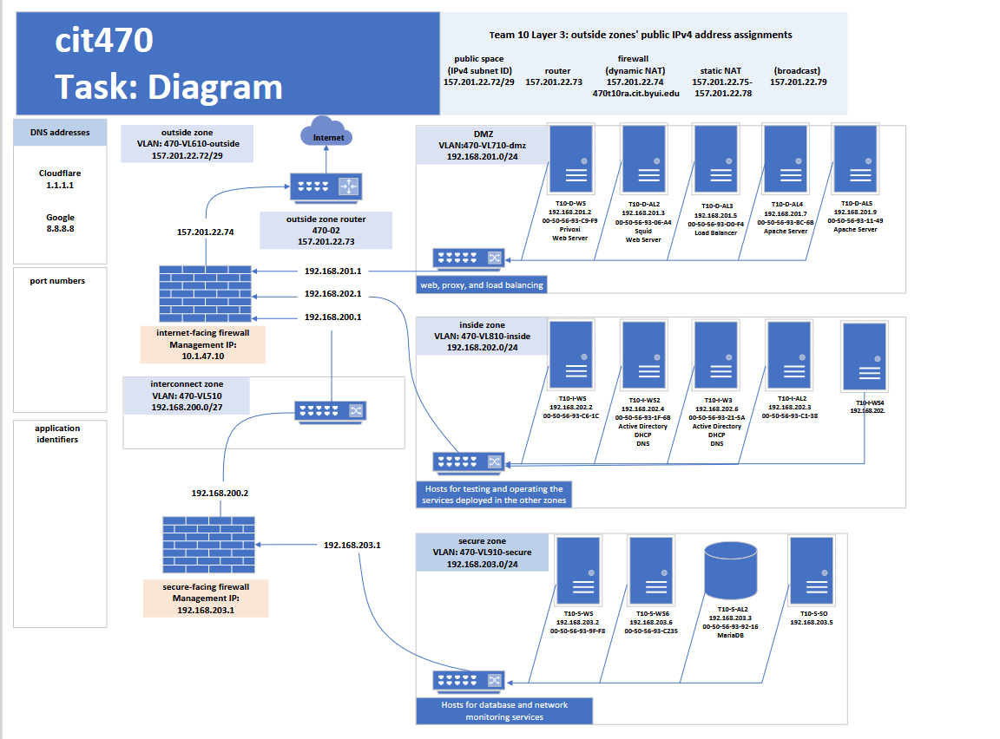

This are a serie of tutorials designed for a virtual network created with vms and firewalls to practice installation, configuration and management of diferent resources.

It has 2 firewalls and 3 diferent zones protected by them. 
- **DMZ** has 5 vms with web services, proxy and load balancer.  
- **Inside zone** has Active directory, dhcp and DNS  
- **Secure zone**  holds the most secure area with databases. 
