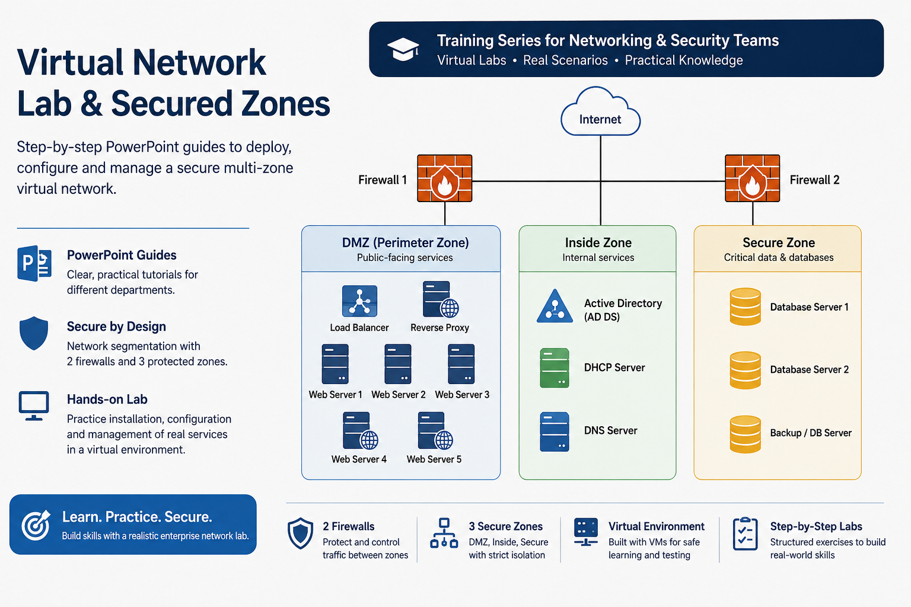

# Virtual Infrastructure Security Training

## Overview

This repository contains a collection of hands-on tutorials and lab guides designed to train networking, systems, and security teams in the deployment and management of enterprise infrastructure.

The project simulates a segmented virtual enterprise network using virtual machines, firewalls, proxies, Active Directory services, VPNs, IDS monitoring, SIEM integration, and multi-tier application deployments.

The labs are delivered through detailed PowerPoint and PDF guides that walk through installation, configuration, troubleshooting, and security best practices in a realistic virtualized environment.

---

## Network Architecture

---

## Infrastructure Overview

The environment is built around a multi-zone secure network architecture protected by two firewalls and segmented into three security zones:

### DMZ (Perimeter Zone)

The DMZ hosts public-facing services and application infrastructure:

- Reverse proxies
- Web servers
- Load balancers
- Proxy services
- Tiered applications

### Inside Zone

The internal enterprise zone provides centralized infrastructure services:

- Active Directory
- DNS
- DHCP
- Windows Server administration
- Cockpit server management

### Secure Zone

The secure zone isolates critical services and sensitive resources:

- Database servers
- SIEM components
- Security monitoring services
- VPN and encrypted communications

This segmentation model reflects real-world enterprise security practices and provides hands-on experience with layered network defense.

---

## Learning Objectives

These tutorials are designed to help students and IT professionals practice:

- Enterprise network segmentation
- Firewall configuration and policy management
- Active Directory deployment
- DNS and DHCP infrastructure
- Reverse proxy and web filtering
- Intrusion detection systems (IDS)
- SIEM monitoring and log analysis
- Secure VPN communications
- Multi-tier application deployment
- Traffic analysis with Wireshark
- Virtual machine management
- Infrastructure troubleshooting

---

## Included Tutorials

| Tutorial | Topics Covered |
|---|---|
| Active Directory | Domain services, users, groups, policies |
| DHCP & Active Directory | Dynamic IP management integrated with AD |
| DNS & DHCP Windows Server | Enterprise network services |
| Firewalls | Network segmentation and filtering |
| IDS Sensor | Intrusion detection and monitoring |
| SIEM | Centralized logging and security events |
| Wireshark | Packet capture and network analysis |
| IPsec VPN Site-to-Site | Secure encrypted communications |
| Acrylic DNS & Privoxy Proxy | DNS filtering and proxy services |
| Proxy Services Team | Web proxy infrastructure |
| ServerVMs | Virtual server deployment and management |
| TieredApp | Multi-tier application architecture |
| ActiveDirectory & Cockpit | Linux server administration integration |

---

## Technologies & Platforms

- VirtualBox
- VMware
- Windows Server
- Linux Server
- Active Directory
- DHCP
- DNS
- IPsec VPN
- Proxy Services
- IDS / SIEM
- Wireshark
- Firewall Administration
- Multi-tier Architectures
- Virtual Networking

---

## Practical Training Environment

All labs are designed for hands-on implementation inside a controlled virtual environment using multiple VMs and isolated network segments.

The tutorials focus on:

- Real-world troubleshooting
- Deployment procedures
- Security hardening
- Operational management

This repository can be used for:

- Cybersecurity practice
- Networking education
- Homelab learning
- Classroom environments
- Infrastructure demonstrations

---

## Future Improvements

Planned additions include:

- Kubernetes deployment labs
- Docker networking tutorials
- Terraform infrastructure provisioning
- Ansible automation
- Centralized monitoring with Prometheus & Grafana
- Zero Trust network architecture
- Cloud deployment scenarios

---

## Contributions

Suggestions, improvements, and additional lab ideas are welcome. Feel free to fork the repository and contribute to the project.

